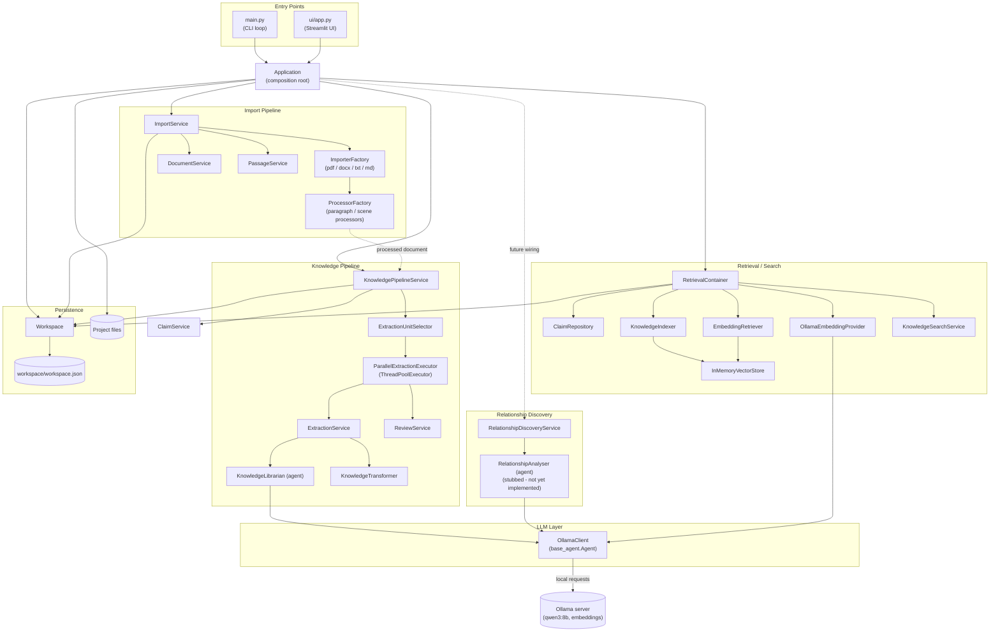

```mermaid
flowchart TD
    subgraph Entry["Entry Points"]
        CLI["main.py\n(CLI loop)"]
        UI["ui/app.py\n(Streamlit UI)"]
    end

    APP["Application\n(composition root)"]
    CLI --> APP
    UI --> APP

    subgraph Import["Import Pipeline"]
        IS["ImportService"]
        IMP["ImporterFactory\n(pdf / docx / txt / md)"]
        PROC["ProcessorFactory\n(paragraph / scene processors)"]
        DOC["DocumentService"]
        PASS["PassageService"]

        IS --> IMP
        IMP --> PROC
        IS --> DOC
        IS --> PASS
    end

    APP --> IS

    subgraph Pipeline["Knowledge Pipeline"]
        KPS["KnowledgePipelineService"]
        SEL["ExtractionUnitSelector"]
        EXE["ParallelExtractionExecutor\n(ThreadPoolExecutor)"]
        ES["ExtractionService"]
        LIB["KnowledgeLibrarian (agent)"]
        XFORM["KnowledgeTransformer"]
        REV["ReviewService"]

        KPS --> SEL
        SEL --> EXE
        EXE --> ES
        ES --> LIB
        ES --> XFORM
        EXE --> REV
    end

    APP --> KPS
    PROC -.processed document.-> KPS
    KPS --> CS["ClaimService"]

    subgraph RelDiscovery["Relationship Discovery"]
        RDS["RelationshipDiscoveryService"]
        RAN["RelationshipAnalyser (agent)\n(stubbed - not yet implemented)"]
        RDS --> RAN
    end

    APP -.future wiring.-> RDS

    subgraph Retrieval["Retrieval / Search"]
        RC["RetrievalContainer"]
        REPO["ClaimRepository"]
        EMB["OllamaEmbeddingProvider"]
        IDX["KnowledgeIndexer"]
        VS["InMemoryVectorStore"]
        RET["EmbeddingRetriever"]
        KSS["KnowledgeSearchService"]

        RC --> REPO
        RC --> EMB
        RC --> IDX
        IDX --> VS
        RC --> RET
        RET --> VS
        RC --> KSS
    end

    APP --> RC

    subgraph LLM["LLM Layer"]
        OC["OllamaClient\n(base_agent.Agent)"]
    end

    LIB --> OC
    RAN --> OC
    EMB --> OC
    OC -->|local requests| OLLAMA[("Ollama server\n(qwen3:8b, embeddings)")]

    subgraph Persistence["Persistence"]
        WS["Workspace"]
        WSJSON[("workspace/workspace.json")]
        PROJJSON[("Project files")]
    end

    APP --> WS
    IS --> WS
    KPS --> WS
    RC --> WS
    WS --> WSJSON
    APP --> PROJJSON
```