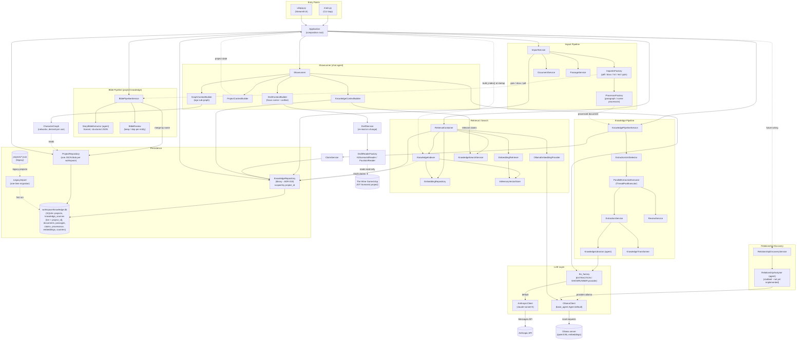

```mermaid
flowchart TD
    subgraph Entry["Entry Points"]
        CLI["main.py\n(CLI loop)"]
        UI["ui/app.py\n(Streamlit UI)"]
    end

    APP["Application\n(composition root)"]
    CLI --> APP
    UI --> APP

    subgraph Import["Import Pipeline"]
        IS["ImportService"]
        IMP["ImporterFactory\n(pdf / docx / txt / md / pptx)"]
        PROC["ProcessorFactory\n(paragraph / scene processors)"]
        DOC["DocumentService"]
        PASS["PassageService"]

        IS --> IMP
        IMP --> PROC
        IS --> DOC
        IS --> PASS
    end

    APP --> IS

    subgraph Bible["Bible Pipeline (project knowledge)"]
        BPS["BiblePipelineService"]
        SBE["StoryBibleExtractor (agent)\nSonnet, structured JSON"]
        BREV["BibleReview\n(keep / skip per entity)"]

        BPS --> SBE
        BPS --> BREV
    end

    APP --> BPS
    IMP -.pptx / docx / pdf.-> BPS
    BPS -->|merge by name| PREPO

    subgraph Pipeline["Knowledge Pipeline"]
        KPS["KnowledgePipelineService"]
        SEL["ExtractionUnitSelector"]
        EXE["ParallelExtractionExecutor\n(ThreadPoolExecutor)"]
        ES["ExtractionService"]
        LIB["KnowledgeLibrarian (agent)"]
        XFORM["KnowledgeTransformer"]
        REV["ReviewService"]

        KPS --> SEL
        SEL --> EXE
        EXE --> ES
        ES --> LIB
        ES --> XFORM
        EXE --> REV
    end

    APP --> KPS
    PROC -.processed document.-> KPS
    KPS --> CS["ClaimService"]
    IS --> KREPO
    CS --> KREPO

    subgraph RelDiscovery["Relationship Discovery"]
        RDS["RelationshipDiscoveryService"]
        RAN["RelationshipAnalyser (agent)\n(stubbed - not yet implemented)"]
        RDS --> RAN
    end

    APP -.future wiring.-> RDS

    subgraph Retrieval["Retrieval / Search"]
        RC["RetrievalContainer"]
        EREPO["EmbeddingRepository"]
        EMB["OllamaEmbeddingProvider"]
        IDX["KnowledgeIndexer"]
        VS["InMemoryVectorStore"]
        RET["EmbeddingRetriever"]
        KSS["KnowledgeSearchService"]

        RC --> EREPO
        RC --> EMB
        RC --> IDX
        IDX --> EREPO
        IDX --> VS
        RC --> RET
        RET --> VS
        RC --> KSS
    end

    APP --> RC
    RC --> KREPO
    IDX -.reads claims.-> KREPO
    APP -.build_index() at startup.-> IDX

    subgraph Showrunner["Showrunner (chat agent)"]
        SR["Showrunner"]
        KCTX["KnowledgeContextBuilder"]
        PCTX["ProjectContextBuilder"]
        GCTX["GraphContextBuilder\n(ego sub-graph)"]
        DCTX["DraftContextBuilder\n(focus scene + outline)"]

        SR --> KCTX
        SR --> PCTX
        SR --> GCTX
        SR --> DCTX
    end

    APP --> SR
    KCTX -->|relevant claims| KSS
    KCTX --> KREPO
    PCTX -.project state.-> APP
    GCTX --> CGRAPH["CharacterGraph\n(networkx, derived per use)"]
    CGRAPH -.reads.-> PREPO
    DCTX --> DSVC["DraftService\n(re-read on change)"]
    DSVC --> DRF["DraftReaderFactory\nKitScenaristReader / FountainReader"]
    DRF -.reads read-only.-> SCRIPT[("The Wine Game.kitsp\n(KIT Scenarist project)")]

    subgraph LLM["LLM Layer"]
        FACTORY["llm_factory\n(EXTRACTION / SHOWRUNNER provider)"]
        AC["AnthropicClient\n(claude-sonnet-5)"]
        OC["OllamaClient\n(base_agent.Agent default)"]
    end

    LIB --> FACTORY
    SR --> FACTORY
    FACTORY -->|default| AC
    FACTORY -.provider=ollama.-> OC
    RAN --> OC
    EMB --> OC
    AC -->|Messages API| ANTHROPIC[("Anthropic API")]
    OC -->|local requests| OLLAMA[("Ollama server\n(qwen3:8b, embeddings)")]

    subgraph Persistence["Persistence"]
        KREPO["KnowledgeRepository\n(library - ADR-019)\nscoped by project_id"]
        PREPO["ProjectRepository\n(one JSON blob per workspace)"]
        DB[("workspace/knowledge.db\n(SQLite: projects, knowledge_sources\n[tier + project_id], documents, passages,\nclaims, provenance, embeddings, counters)")]
        PROJJSON[("projects/*.json\n(legacy)")]
        LI["LegacyImport\n(one-time migration)"]
    end

    APP --> KREPO
    APP --> PREPO
    KREPO --> DB
    PREPO --> DB
    LI -.first run.-> DB
    PROJJSON -.legacy projects.-> LI
```